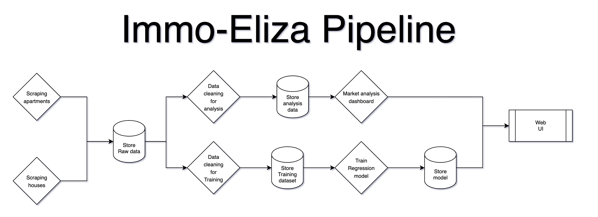

# Immo Eliza pipeline

- Repository: `immoeliza-airflow`
- Type of Challenge: `Consolidation`
- Duration: `5 days`
- Deadline: `12/09/2025 4:30 PM`
- Team challenge : `solo`

## Introduction

The Immo Eliza company asks you to develop a pipeline to automate their work.

## Task

The goal is simple: They want to monitor their famous competitor: Immoweb. Because Immoweb is difficult to scrape at the moment, you can use any other real estate website. The goal is to build a nice airflow, not to struggle 3 days on immoweb blocking you. 

Here are the tasks:

- Scrape every night all the apartments on sale.
- Scrape every night all the houses on sale.
- Make an interactive dashboard to analyze the market.
- Train a regression model and evaluate its performance.

And the requirements:

- Your datasets need to be versioned.
- Your models need to be versioned.
- You will need to apply a different pre-processing for analyzing data and for training models.

As your manager is still a nice person, here is the architecture schema you need to follow:

## Tools

To complete this challenge, you will be required to use [Apache Airflow](https://airflow.apache.org/), a famous pipeline tool used in the industry.
